# node_js_command_line_todo_list

#### 介绍
node js 命令行待办

#### 安装教程

```bash
// 安装依赖
$ npm i

// 编译构建
$ npm run build

// 安装到全局
$ npm i . -g

// 更新环境变量
$ source ~/.bash_profile

// 验证成功
$ todo -h
```

#### 使用说明

<span style="color: chartreuse;">**查看帮助**</span>

```bash
todo -h
```

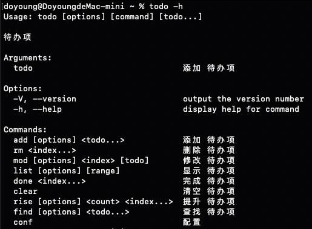

<span style="color: chartreuse;">**查看版本**</span>

```bash
todo -V
```

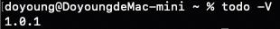

<span style="color: chartreuse;">**添加待办**</span>

```bash
todo 1
```

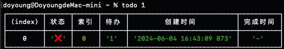

```bash
todo add 2
```


<span style="color: chartreuse;">**批量添加待办**</span>

```bash
todo 3 4 5
```


```bash
todo add 6 7 8
```


<span style="color: chartreuse;">**添加待办时设置完成**</span>

```bash
todo add 9 -d
```

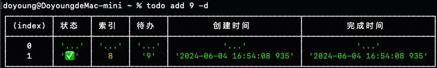

<span style="color: chartreuse;">**移除待办项**</span>

```bash
todo rm 8
```

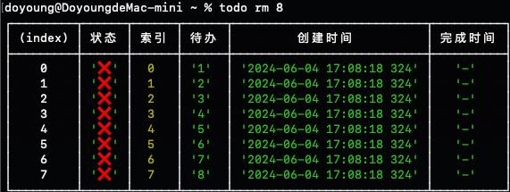

<span style="color: chartreuse;">**批量移除待办项**</span>

```bash
todo rm 7 6 5 4 3 2 1 0
```

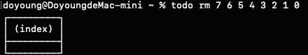

```bash
todo rm 8 4 7 3 6 2 5 0 1
```

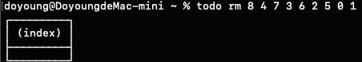

> 索引顺序不敏感

<span style="color: chartreuse;">**修改待办内容**</span>

```bash
todo mod 0 after
```

*之前*

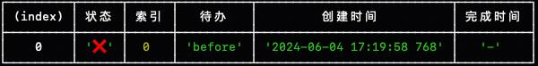

*之后*


<span style="color: chartreuse;">**待办内容后追加**</span>

```bash
todo mod 0 \ append -a
```

*之前*

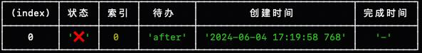

*之后*


<span style="color: chartreuse;">**修改待办状态为完成**</span>

```bash
todo mod 0 -d true
```

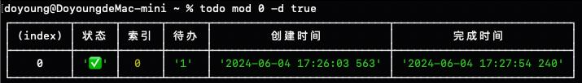

```bash
todo done 0
```

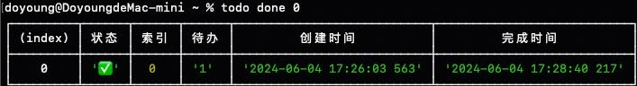

<span style="color: chartreuse;">**查看所有待办**</span>

```bash
todo
```

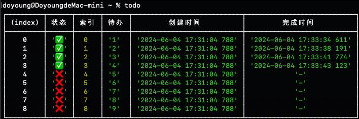

```bash
todo list
```

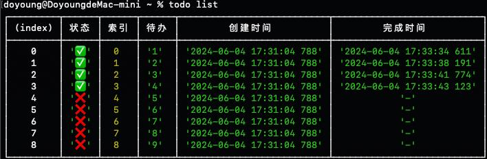

<span style="color: chartreuse;">**查看所有已完成的待办**</span>

```bash
todo list -d
```


```bash
todo list -d true
```


<span style="color: chartreuse;">**查看所有未完成的待办**</span>

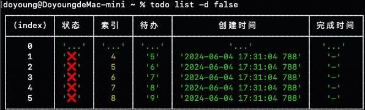

<span style="color: chartreuse;">**查看前五个待办**</span>

```bash
todo list 5]
```

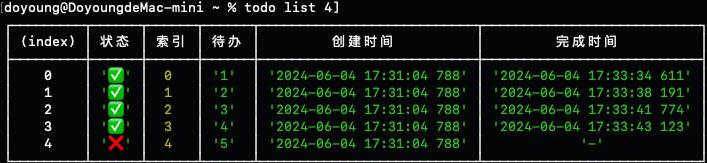

<span style="color: chartreuse;">**查看第五个之后的待办**</span>

```bash
todo list 5
```


